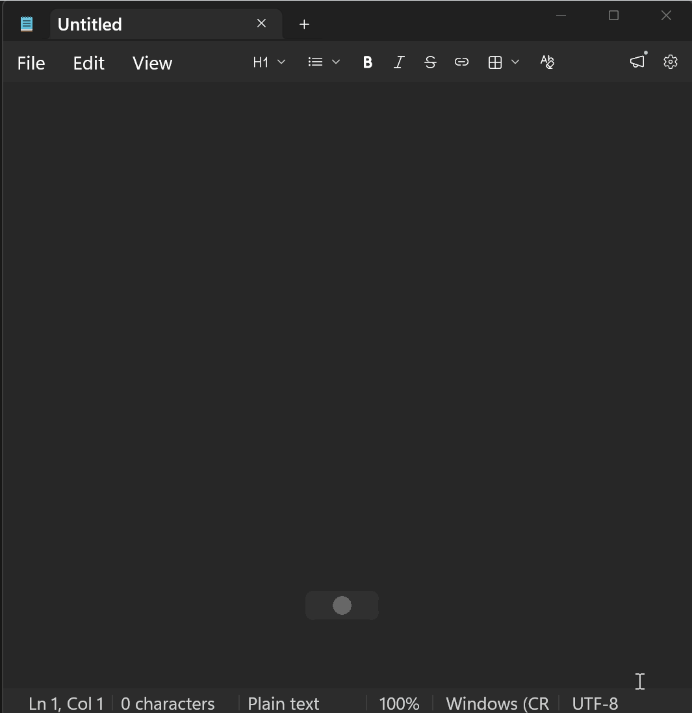

# Talker — voice typing for Windows

[](https://github.com/cutandship/talker/actions/workflows/test.yml)
[](LICENSE)


[🇷🇺 Русский](README.md) · 🇬🇧 English

**You speak — text appears at the cursor.** Fully offline: no audio and no word
ever leaves your machine. Russian is first-class via
[GigaAM v3](https://github.com/salute-developers/GigaAM) (the best open model for
Russian speech); any other language goes through Whisper.



## Download

### ⬇️ [Install Talker — TalkerSetup.exe (292 MB)](https://github.com/cutandship/talker/releases/latest)

Offline installer for Windows 10/11: the recognition model, runtime and all
dependencies are already inside — works out of the box, no internet, no Python.

## Features

- **Push-to-talk** — hold `Right Alt`, speak, release. Text is inserted into the
  active window (Telegram, Word, browser, IDE — anywhere).
- **Hands-free dictation** — `Ctrl+Alt+Space` or wake-word "Hey Jarvis…
  stop-stop". A media guard stops a movie playing in your speakers from typing
  for you.
- **Smart post-processing, no AI cloud**: fillers ("um", "uh") are stripped,
  "twenty five percent" → "25 %", spoken formatting commands ("item one… item
  two", "new paragraph", "dash") become real lists and paragraphs, plus a
  dictionary of names/terms and replacements ("clod" → "Claude").
- **Floating capsule** with a live voice waveform and ✕/✓ buttons — it never
  steals focus from the window you dictate into.
- **History** with instant search; export to TXT/SRT/VTT/JSON.
- **File & YouTube transcription** — drop an mp3/mp4 or paste a link.
- **Quiet mode** — for whispering (separate gain and thresholds).
- **Local HTTP API** — for Raycast/vim/scripts (127.0.0.1, token).
- Settings and history are lightweight web windows (a single HTML file), no
  browser tabs, with dark and light themes.

## Install

Requirements: Windows 10/11, Python 3.11+, a microphone.

```bash
git clone https://github.com/cutandship/talker
cd talker
pip install -r requirements.txt
pythonw main.py
```

On first launch the recognition model is downloaded (~250 MB for GigaAM, progress
shown in the tray). After that — fully offline.

A capsule appears on screen and an icon in the tray. **Hold `Right Alt` and say
something** — the text shows up where your cursor is.

## Hotkeys

| Action | Key |
|---|---|
| Dictate (hold and speak) | `Right Alt` (configurable) |
| Hands-free dictation (toggle) | `Ctrl+Alt+Space` |
| Start/stop by voice | "Hey Jarvis" … "stop-stop" (optional) |
| Settings / History | tray icon, right-click the capsule |

## Privacy

Recognition, history and settings live only on your machine. No telemetry, no
cloud, no accounts. The log contains no dictation text.

## Tests

```bash
pip install -r requirements-dev.txt
pytest tests/
```

## What's next (Talker+)

Free Talker stays free. A paid version is planned for things that need servers
and sync: phone-as-microphone over the internet, meeting mode (who said what +
summary), dictionary sync across devices, running without a Python install.
A browser-based online version and the extended **Talker+** live at
[cutandship.dev](https://cutandship.dev). Follow along:
[t.me/cut_and_ship](https://t.me/cut_and_ship).

## Author

**Cut & Ship** — [cutandship.dev](https://cutandship.dev) ·
[Telegram](https://t.me/cut_and_ship) · <cutandship@proton.me>

I build custom voice integrations on contract: voice input inside your app, CRM
or internal tool — on your infrastructure, with no data leaving it. Get in touch.

## License

[MIT](LICENSE). Models: [GigaAM](https://github.com/salute-developers/GigaAM)
(MIT), [faster-whisper](https://github.com/SYSTRAN/faster-whisper)
(MIT). Font [Inter](https://rsms.me/inter/) — SIL OFL 1.1. Full third-party
license list — [THIRD_PARTY_LICENSES.md](THIRD_PARTY_LICENSES.md).
